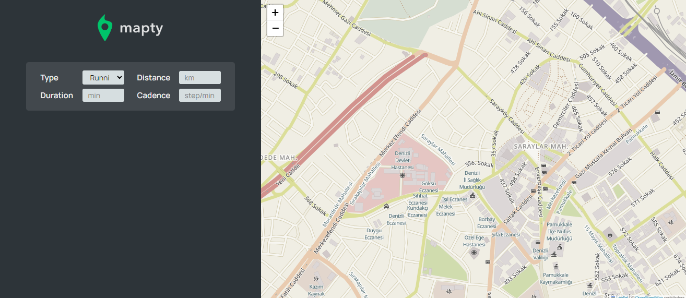
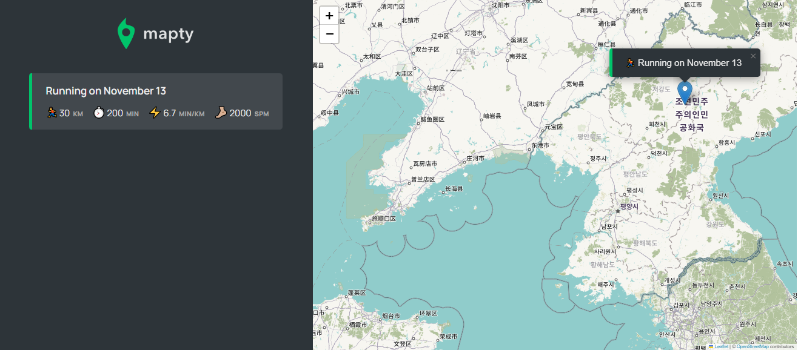
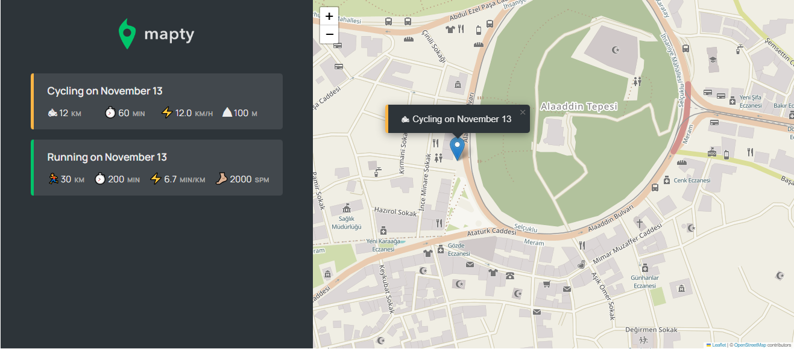

# Mapty-App
## Jonas Schmedtmann eşliğinde  *leaflet kütüphanesini* kullanarak Mapty-App uygulamasını oluşturdum.

### Bu uygulamada yapabilecekleriniz:
* Uygulamayı açtığınızda ilk olarak sizden konumunuza erişim izni isteyecektir. İzin verdiğiniz takdirde harita konumunuza göre yüklenecektir.
* O an ki konumunuz dışında istediğiniz konumu işaretleyebilirsiniz.
* Seçilen konum için ekranın solunda form oluşacaktır.
* Form için running ya da cycling seçeneklerini seçebilirsiniz.
* Running seçeneği için *distance*, *duration* ve *cadence* değerlerini girmelisiniz.
* Cycling seçeneği için *distance*, *duration* ve *elevation gain* değerlerini girmelisiniz.
 

## <h3>🔴Live Server: <a href="https://mapty-app-betul.netlify.app/">Mapty-App</a></h3>

 ###  🛠 Kullandığım teknolojiler :
     
 
### Object Oriented Programming tasarım deseni kullandım (OOP).

## ✨Projenin görselleri :

